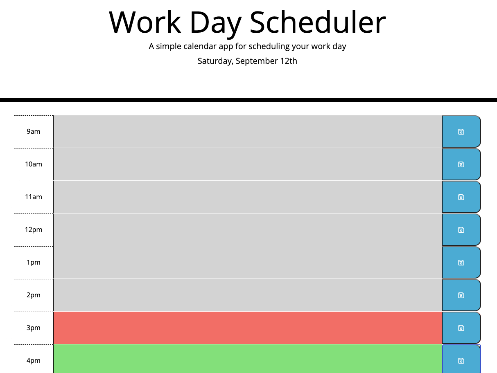
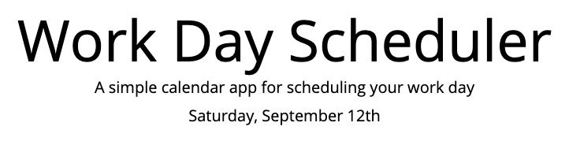
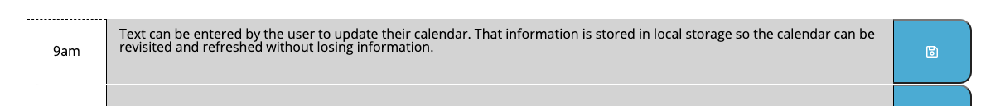
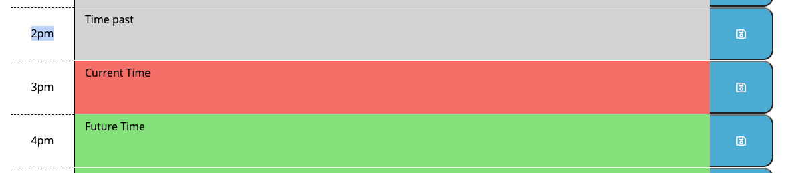

# Dynamically updated Day Calendar

This is a daily work calendar that displays current past and future textblock updating to help the user manage their day to day tasks.

[Workday Calendar](https://raleighc.github.io/homework_05-day_calendar/)

## Usage
This calendar is meant for the user to organize their daily tasks.

On the pages header, the day and time are dynamically updated.

The user can enter their information for their daily activities into the text fields associated with each hour of the 9-5 workday. After entering their information they will click the block save button to save their information to local storage so their calendar will not erase upon page refresh.

As the day progresses, each block will be dynamically updated to change color to represent the past present and future hours. The blocks in grey represent hours that have already passed. The current hour is displayed in red. And the hours in green are the remaining hours of the day.

## Creating This Page

For this project, I was provided with a starting HTML and CSS file. I made minor additions to those files but most of my work was accomplished in the script file. Using jQuery, I dynamically populated the html and applied the css to each element. Using momentjs.com, I inserted the day and date into the calendar header and updated the hourly time blocks by dynamically applying css styles to each textarea. The text blocks and individually connected to their own save buttons to give the user more individual control over updating the page. The information entered is stored in Local Storage in the users browser so that the information remains in place update page refresh or when leaving and returning to the site.

## Contributions

When contributing to this repository, please contact the owner of the repository before pushing any updates.
When contributions are accepted, please update the readme.md noting any changes that have been made.

## Authors and Acknowledgment

The HTML and CSS files for this project were created and supplied by Georgia Tech Coding Boot Camp.

* [Bootstrap](https://getbootstrap.com/)
* [Font Awesome](https://fontawesome.com/)
* [w3schools!](https://www.w3schools.com/bootstrap4/default.asp)
* [Moment.js](https://momentjs.com/)

Thank you to all of my GT Bootcamp classmates who have offered advice and helped fix bugs alone the way.

Special thanks to my tutor Simon Rennocks for helping me understand onclick application to elements better.

## License

MIT License

Copyright (c) 2020 Raleigh Chesney

Permission is hereby granted, free of charge, to any person obtaining a copy
of this software and associated documentation files (the "Software"), to deal
in the Software without restriction, including without limitation the rights
to use, copy, modify, merge, publish, distribute, sublicense, and/or sell
copies of the Software, and to permit persons to whom the Software is
furnished to do so, subject to the following conditions:

The above copyright notice and this permission notice shall be included in all
copies or substantial portions of the Software.

THE SOFTWARE IS PROVIDED "AS IS", WITHOUT WARRANTY OF ANY KIND, EXPRESS OR
IMPLIED, INCLUDING BUT NOT LIMITED TO THE WARRANTIES OF MERCHANTABILITY,
FITNESS FOR A PARTICULAR PURPOSE AND NONINFRINGEMENT. IN NO EVENT SHALL THE
AUTHORS OR COPYRIGHT HOLDERS BE LIABLE FOR ANY CLAIM, DAMAGES OR OTHER
LIABILITY, WHETHER IN AN ACTION OF CONTRACT, TORT OR OTHERWISE, ARISING FROM,
OUT OF OR IN CONNECTION WITH THE SOFTWARE OR THE USE OR OTHER DEALINGS IN THE
SOFTWARE.

